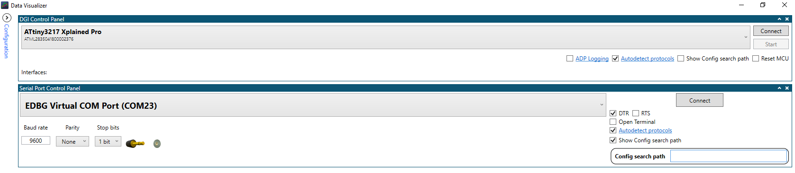
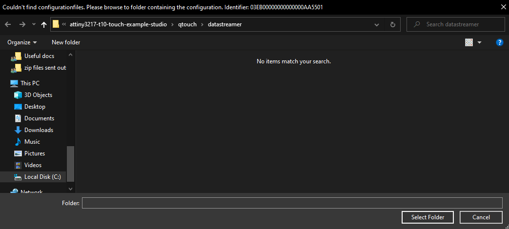

# Touch Example using T10 and ATtiny3217 Xplained Pro kit

This example demonstrates touch application on ATtiny3217 XPRO with T10 extension board. The example project provides user feedback to touch using the T10 onboard LEDS, and via a PC running Microchip MPLAB® Data Visualizer.

## Related Documentation

- ATtiny3217 Xplainedpro kit user guide [(DS50002765A)](https://ww1.microchip.com/downloads/en/DeviceDoc/ATtiny3217-Xplained-Pro-DS50002765A.pdf)
- MPLAB® Data Visualizer user guide [(Data Visualizer user guide)](https://www.microchip.com/content/dam/mchp/documents/DEV/ProductDocuments/UserGuides/MPLAB_Data_Visualizer_50003001A.pdf)

## Software Used

- Microchip Studio 7 7.0.2542 or later [(microchip-studio-for-avr-and-sam-devices)](https://www.microchip.com/en-us/development-tools-tools-and-software/microchip-studio-for-avr-and-sam-devices)
- AVR-GCC 3.62 or newer toolchain [(Toolchains for AVR)](https://www.microchip.com/en-us/development-tools-tools-and-software/gcc-compilers-avr-and-arm)
- ATtiny_DFP (1.8.322) or later [(packs.download.microchip.com)](https://packs.download.microchip.com/)
- MPLAB® Data Visualizer [(Data Visualizer)](https://www.microchip.com/en-us/development-tools-tools-and-software/embedded-software-center/mplab-data-visualizer)

## Hardware Used

- ATtiny3217 Xplained Pro [(ATTINY3217-XPRO)](https://www.microchip.com/DevelopmentTools/ProductDetails/PartNO/ATTINY3217-XPRO)
- T10 Xplained Pro Extension Kit [(AC47H23A)](https://www.microchip.com/developmenttools/ProductDetails/AC47H23A)

## Setup

1. Connect T10 Extension header 3 (EXT3) to ATtiny3217 Xplained Pro kit Extension Header 1 (EXT1).
2. Connect PC to the MCU board Debug USB port. 

## Operation

1. Open the .atsln file in Microchip Studio.
2. Build the solution and program the device.
3. Open MPLAB® Data Visualizer and configure Serial Port Control Panel (above):
   - Autodetect Protocols = true 
   - Show Config path = true
4. Connect.

5. When prompted, navigate to "attiny3217-t10-touch-example-studio\qtouch\datastreamer" and select folder (above)

## Summary

This example has illustrated how to use the ATtiny3217 XPRO with T10 extension board.
